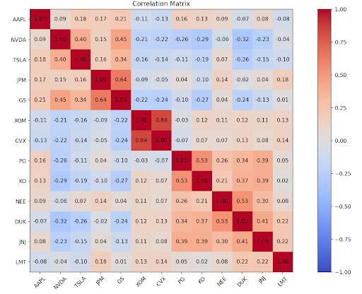

# stock_pca_study
This project is a Principal component analysis of a correlation matrix consisting of a basket of stocks.

## about the project

created as my first real data science project in order to apply data science skills such as linear algebra. At first I used a covariance matrix but ran into the issue of one company with a large variation dominating the principal components. Thus I switched to a correlation matrix that normalized each stock with its own variation. Correlation matrix is visualized with matplotlib, and individual principal components and eigenvectors listed in command line. Ran on a variety of baskets with one example pictured below



## Installation

1. **Clone repo**
    ```bash
    git clone https://github.com/DimaP26/stock_pca_study.git
    cd stock_pca_study
    ```
    
2. **Install dependencies**
    ```bash
    pip install -r requirements.txt
    ```
    
3. **Run**
    ```
    python3 PCA.py
```

## limitations
- example is run on a 1yr period in which relationships between stocks is recorded; these can change over time
- correlation doesn't mean causation, there could be some unknown underlying confounding market factor. This analysis gives us insight into what areas this market factor could be present, but seperate testing must be conducted to test these hypotheses 

